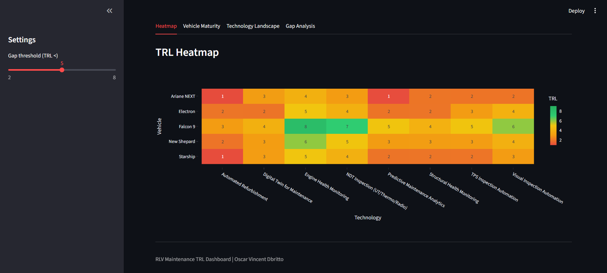
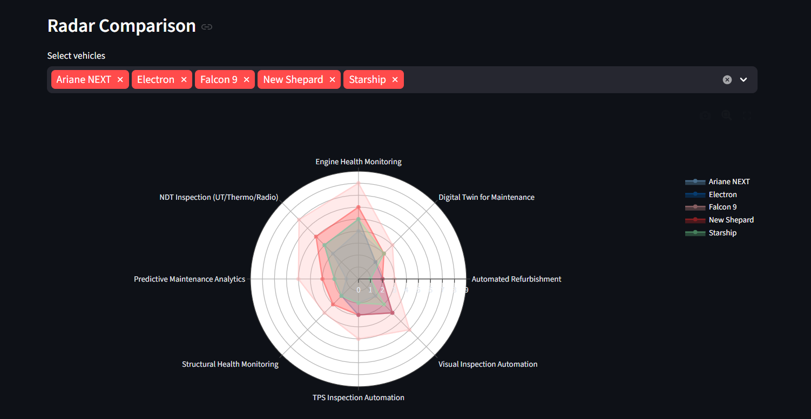
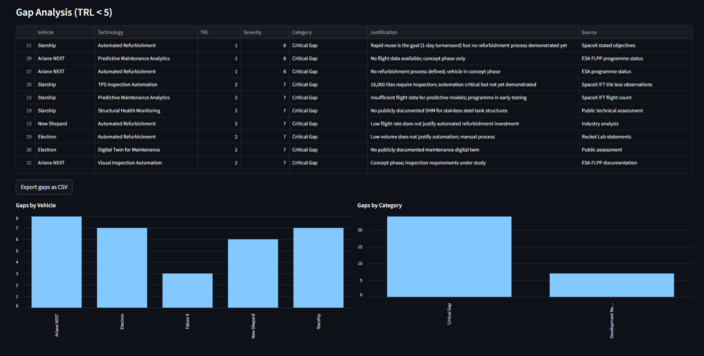

# 🚀 RLV Maintenance Technology Readiness Dashboard

## Overview
Interactive TRL (Technology Readiness Level) assessment dashboard
quantifying the maturity of maintenance technologies across Reusable
Launch Vehicles (RLVs). Evaluates 8 maintenance technology categories
across 5 vehicles — producing 40 individual TRL assessments with
derived gap analysis and prioritised recommendations.

## Live Demo
**[Open Dashboard](https://your-streamlit-url-here.streamlit.app/)**

## Screenshots

| TRL Heatmap | Radar Comparison | Gap Analysis |
|:-----------:|:----------------:|:------------:|
|  |  |  |

## Features
- **TRL Heatmap** — colour-coded matrix (red = low TRL = gap, green = high TRL = mature); adjustable gap threshold slider
- **Vehicle Maturity Scores** — ranked bar chart of overall maintenance technology maturity per vehicle
- **Radar Comparison** — multi-vehicle overlay radar chart across all 8 technology dimensions
- **Technology Landscape** — per-technology statistics (min, max, mean, spread) with leading vehicle identification
- **Gap Analysis** — prioritised gap table (Critical / Development Needed / Validation Required) with TRL justifications and sources
- **CSV Export** — download filtered gap table for further analysis

## TRL Scale Reference

| TRL | Description |
|-----|-------------|
| 1 | Basic principles observed |
| 2 | Technology concept formulated |
| 3 | Experimental proof of concept |
| 4 | Technology validated in lab |
| 5 | Technology validated in relevant environment |
| 6 | Technology demonstrated in relevant environment |
| 7 | System prototype demonstration in operational environment |
| 8 | System complete and qualified |
| 9 | Actual system proven in operational environment |

## Context

Built in the context of DLR Institute of Maintenance and Modification research on maintenance considerations for Reusable Launch Vehicles. As stated in the DLR research brief, maintenance technology for RLVs "remains in its infancy" — this dashboard quantifies exactly where the gaps are using the NASA/ESA TRL framework standard at DLR, ESA, and NASA.

## Relevance
Directly mirrors DLR research tasks: assess and quantify maintenance technology maturity for RLVs
Applies the industry-standard NASA/ESA TRL framework used operationally at DLR
Identifies critical gaps (TRL ≤ 3) requiring immediate R&D investment
Supports life cycle analysis and maintenance technology roadmap planning
Demonstrates structured, data-driven approach to scientific technology assessment

## Author
**Oscar Vincent Dbritto** | [Portfolio](https://oscardbritto.framer.website/) | [Linkedin](https://www.linkedin.com/in/oscar-dbritto/)
